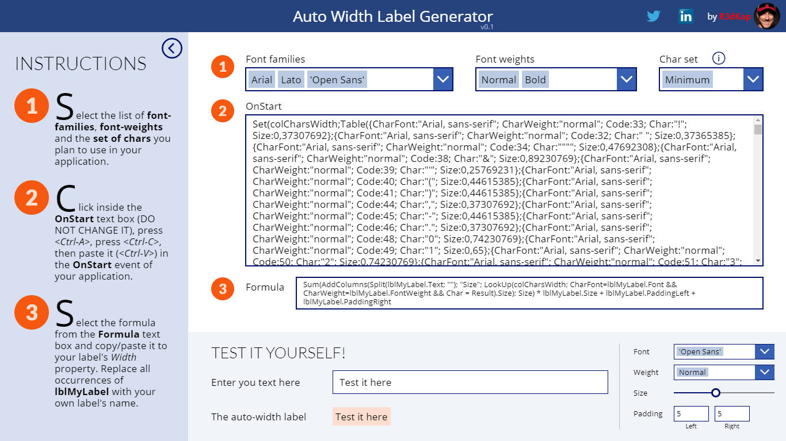
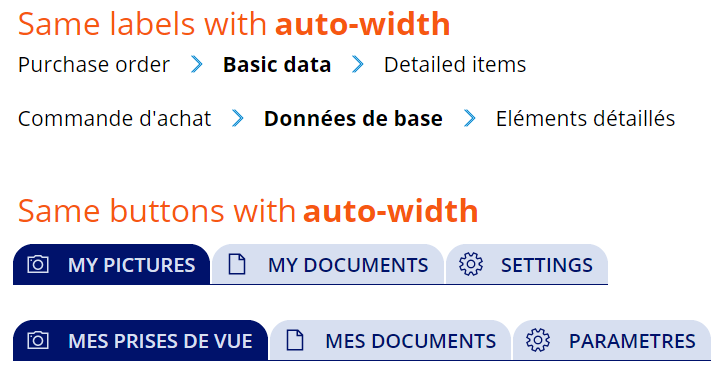
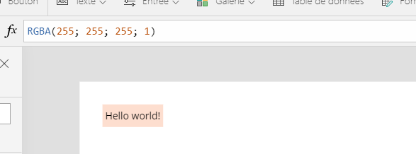

# AutoWidthLabelGenerator component
This component will generate the necessary Power Apps code to have your applications' labels **Width** adapt automatically to their content, whatever the font, the font weight or the font size.

This little trick will allow you, at last, to have good-looking breadcrumbs with nice icons in-between each level moving along with the length of each level's text. It will also allow you to have tabs in any language where your buttons will stick together and expand whatever the language.

Here is how the label auto-sizes itself directly inside the Power Apps Studio:

## Component properties
This component doesn't have any properties as it is standalone and can be used right away.

## Important notes
- The component will be best viewed in a native **tablet form factor** application with a **1366x768 resolution**.
- The component holds a huge collection of about 11,000 items. So it is recommanded that you use it separatly in a **brand new application** or add it to your existing app and remove it as soon as you're done with it. This way, the performance of you app will not be affected.
- It works for **buttons** as well :)

## How it works
The component holds an **internal collection** with the unitary width of each of the 255 characters in the latin ASCII table (well in fact from 32 to 255). And this for each Power Apps font and each font weight. A label's **Width** property in your app will have a small formula that will use a portion of this collection to calulate the size of the label's **Text** property. The portion of collection that will be needed in your app will be inserted in its **OnStart** event. Its content will depend on the fonts and font-weights you plan to use within your app's labels. Then just placing a little formula into your label's **Width** property will do the trick.
- The component needs to initialize a few things before it can start. So, first of all, click on the **INITIALIZE** button.
- Once loaded, the component will pretty much tell you what to do.
- Start by choosing the fonts and font-weights you plan to use in your application's labels.
- You will probably not use the entire 255 characters inside your labels, so you can choose smaller groups of characters using the **Char set** combo box (you can view what are the characters in each set by clicking on the "i" icon just over the combo box).
- The component will then generate for your the code to declare the collection with the characters' sizes. Just put that code in the **OnStart** event of your app and run it to load the collection in memory.
- Then copy/paste the small formula at step 3 into your app's labels **Width** property.
- Et voilààà...

## Updates
- **09-13-2020**: replaced the *lblMyLabel* with the the *Self* operator, thus simplifying step 3 where one will just need to paste the formula
- **05-20-2019**: fixed the **ShowLabel** property that was not effective + added new **LineCapRound** property
