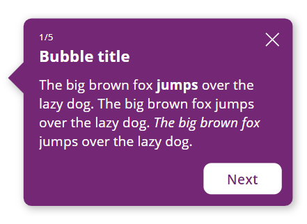
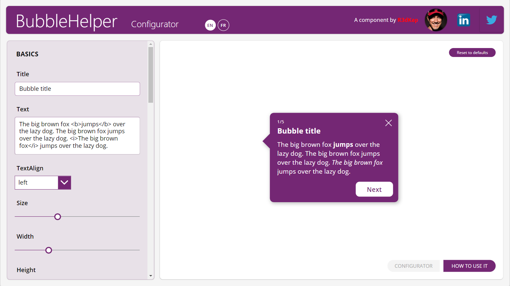
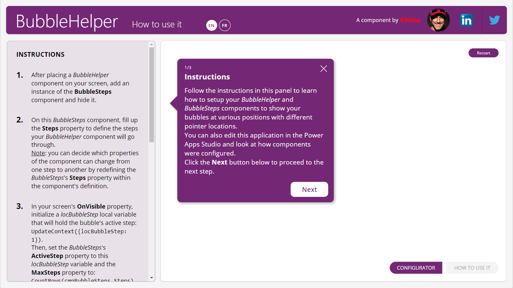

# BubbleHelper component
This component will allow you to add chaining bubbles in your PowerApps applications to help your users understand how your app works.

The design of the bubble can be adjusted through many properties, and events are there to allow you to manage the chaining of your bubble's steps. A **BubbleSteps** component comes with the main **BubbleHelper** component to help you set up the steps which your bubble will go through.

These components are provided within a small application that allows you to understand and test the various properties of the **BubbleHelper** component:

It will also list for you all the instructions on how to use it and set it up in your own Power Apps applications:

This applications comes with two languages: English (EN) and French (FR). If you wish to add a new language to the app, please do not hesitate to contact me on LinkedIn: https://www.linkedin.com/in/egallis.

## **BubbleHelper** component properties
Here are the properties available to configure the **BubbleHelper** component:
### Input
- **Title** (text) = bubble title
- **Text** (text) = content of the bubble
- **TextAlign** (text) = bubble's content alignment (use the native **Align** enumeration to set this property's value; default is **Align.Left**)
- **ShowStep** (boolean) = displays an "X/Y" label over the title to show what's the current step (X) over the total number of steps (Y) (default is **True**)
- **Step** (number) = current step value (default is **1**)
- **MaxSteps** (number) = total number of steps
- **Size** (number) = font size (this value has an effect on all elements containing text in the bubble, not only the text itself but also: the title, the steps and the buttons)
- **Color** (text) = hex color for all text elements inside the bubble (steps, title and text)
- **FillColor** (text) = hex color for the bubble's content
- **BorderColor** (text) = hex color for the bubble's border
- **BorderThickness** (number) = thickness of the bubble's border
- **Radius** (number) = radius for all 4 corners of the bubble
- **Padding** (number) = space (in pixels) between the bubble's border and its content
- **ShowShadow** (boolean) = if enabled, displays a drop shadow for the bubble
- **Shadow** (record) = settings for the drop shadow
  - **OffsetX** (number) = horizontal offset for the shadow (a positive value shows a shadow on the right hand-side of the bubble, a negative value on the left hand-side) (default value is **3**)
  - **OffsetY** (number) = vertical offset for the shadow (a positive value shows a shadow on the bottom-side of the bubble, a negative value on the top-side)  (default value is **3**)
  - **Color** (text) = hex color for the drop shadow  (default value is **#000000AA**)
  - **Blur** (number) = a value to set how much the shadow is blurry (the highest the value, the bluriest the shadow)  (default value is **3**)
  - **Opacity** (decimal) = between 0 and 1, sets how much the shadow is dense  (default value is **0.4**)
- **PointerSize** (number) = in pixels, the size of the bubble's pointer (default is **20**)
- **PointerLocation** (text) = specifies on which side of the bubble the pointer should be rendered (use the component's **PointerLocationEnum** output property to set its value) (default is **Self.PointerLocationEnum.Left**)
- **PointerPosition** (number) = in percentage to the corresponding bubble's side size where the pointer is displayed, the pointer's position (value must be specified between **0** and **100**)
- **ShowClose** (boolean) = shows or hide the 'X' icon in the upper right corner of the bubble used to close the bubble; clicking this icon triggers the **OnClose** event
- **ShowNext** (boolean) = shows or hide the button used to go the next step within the chaining steps provided by the **BubbleSteps** component (default is **True**)
- **NextText** (text) = label for the next step button (default is **Next**)
- **NextWidth** (number) = width for the next step button (default is **100**)
- **ShowPrevious** (boolean) = shows or hide the button used to go the previous step within the chaining steps provided by the **BubbleSteps** component (default is **False**)
- **PreviousText** (text) = label for the previous step button (default is **Previous**)
- **PreviousWidth** (number) = width for the previous step button (default is **130**)
### Events
- **OnClose** = triggered when the user clicks on the 'X' icon displayed in the upper right corner of the bubble
- **OnNext** = triggered when the user clicks on the 'Next' button
- **OnPrevious** = triggered when the user clicks on the 'Previous' button
### Output
- **PointerLocationEnum** (record) = use this enumeration to set the value of the **PointerLocation** property
- **_XXXXXX** = all output properties starting with an underscore character are FOR INTERNAL USE ONLY

## **BubbleSteps** component properties
Here are **BubbleSteps**' component properties available for you to setup the steps for a **BubbleHelper**:
### Input
- **Steps** (table) = within various records, define the values for the **BubbleHelper** component that will change at each step
- **ActiveStep** (number) = number of the current active step (value must be lower than the **MaxSteps** property value of the **BubbleHelper** component)
### Output
- **outStep** (record) = record from the **Steps** property at index **ActiveStep**, thus holding the **BubbleHelper**'s properties values for the current active step

__Note:__ you can decide for yourself which of the **BubbleHelper** properties will change between steps by redefining the **Steps** property default value/structure within the **BubbleSteps** component definition.

## How to install it?
- Download the app [here](BubbleHelper.zip)
- Go to https://make.powerapps.com
- Click on **Applications** in the left menu
- Click the **Import canvas app** button
- Select the downloaded app using the **Upload** button
- Click the **Import** button
- Wait for the import to finish
- You're all done!

Play or edit the app to see how to use and setup these components within your app.

Enjoy! 😊