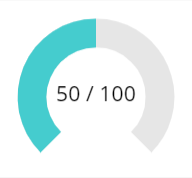

# CircleProgressBar component
This component is a configurable circle progress bar.

## Component properties
Here are the properties available to configure the progress bar:
### Input
- **Max** (number) = maximum value (default is **100**)
- **Value** (number) = actual progress value (default is **50**)
- **ShowLabel** (boolean) = shows/hides the label in the center (default is **True**)
- **LabelSize** (number) = font size for the label in the center (default is **20**)
- **BarBgR, BarBgG, BarBgB** (numbers) = red, green and blue components for the color of the background progress circle (the grey one on the capture above)
- **BarR, BarG, BarB** (numbers) = red, green and blue components for the color of the actual progress circle (the cyan one on the capture above)
- **BarBgWidth** (number) = width for the background progress circle
- **BarWidth** (number) = width for the actual progress circle
- **LineCapRound** (boolean) = if True, the line cap for drawing the circles is 'round', otherwise it's 'square' (default is **True**)
- **ValueMode** (text) = how to display the value within the circle: X/Y or as a percentage value (use the **ValueModeEnum** output property as an enumeration to set the value)
- **PercentageDecimals** (number) = determines how many decimals are shown for the percentage value (only applicable if **ValueMode** is set to *ValueModeEnum.Percentage*)
### Output
- **ValueModeEnum** (record) = use this enumeration to set the value of the **ValueMode** property (*MaxValue* shows the value as X/Y; *Percentage* shows the value as a percentage value, using the **PercentageDecimals** property to set how many decimals should be displayed)

### Examples
Set the **LineCapRound** property of the component to **False** if you want your progress bar look like this:

### Updates
- **05-20-2019**: fixed the **ShowLabel** property that was not effective + added new **LineCapRound** property
- **05-11-2020**: added the **ValueMode**, **PercentageDecimals** and **ValueModeEnum** properties to allow different display modes for the value
