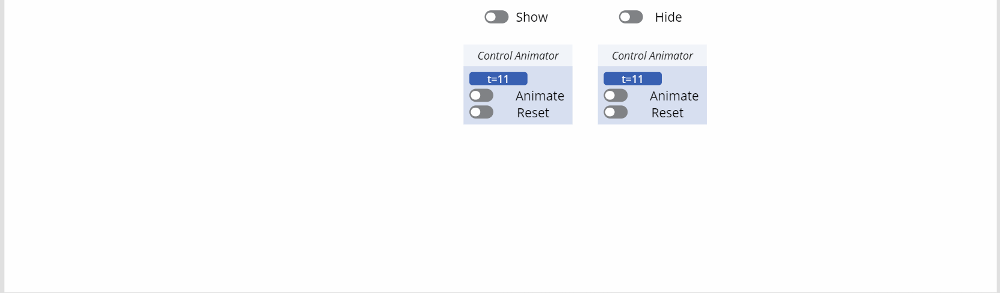
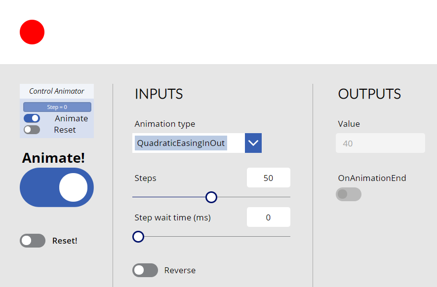

# ControlAnimator component
This component implements the ease-in and ease-out animations that are often met in web site or mobile applications.

Here are a few examples of animations that you can obtain using the component:

## Notes
Credits for the various math functions to calculate the ease-in and ease-out values: *Robert Penner* on http://www.gizma.com/easing/

The component globally generates **floating point numbers** that range from a **start value** to an **end value** within a certain number of **steps**. These numbers are generated using the ease-in and ease-out animation math functions provided by *Robert Penner* on his site.

Generally speaking, here is what 'ease-in' and 'ease-out' mean:
- **Ease-In**: starts slowly from the **start value** and accelerates until it reaches the **end value**

- **Ease-Out**: starts at max speed from the **start value** and deccelerates until it stops at the **end value**

- **Ease-In/Out**: starts slowly from the **start value** and accelerates until it reaches **half-way** and then deccelerates until it stops at the **end value**

The following animations are available:
- **SimpleLinear** (no acceleration)
- **CubicEasingIn** (cubic acceleration)
- **CubicEasingOut** (cubic decceleration)
- **CubicEasingInOut** (cubic acceleration/decceleration)
- **QuadraticEasingIn** (quadratic acceleration)
- **QuadraticEasingOut** (quadratic decceleration)
- **QuadraticEasingInOut** (quadratic acceleration/decceleration)
- **QuarticEasingIn** (quartic acceleration)
- **QuarticEasingOut** (quartic decceleration)
- **QuarticEasingInOut** (quartic acceleration/decceleration)
- **QuinticEasingIn** (quintic acceleration)
- **QuinticEasingOut** (quintic decceleration)
- **QuinticEasingInOut** (quintic acceleration/decceleration)
- **ExponentialEasingIn** (exponential acceleration)
- **ExponentialEasingOut** (exponential decceleration)
- **ExponentialEasingInOut** (exponential acceleration/decceleration)
- **SinusoidalEasingIn** (sinusoidal acceleration)
- **SinusoidalEasingOut** (sinusoidal decceleration)
- **SinusoidalEasingInOut** (sinusoidal acceleration/decceleration)
- **CircularEasingIn** (circular acceleration)
- **CircularEasingOut** (circular decceleration)
- **CircularEasingInOut** (circular acceleration/decceleration)

Globally speaking, animation 'speeds-up' when used in the following order: **Cubic** > **Quadratic** > **Quartic** > **Quintic**.

## Properties
Here are the properties available to configure the animation:
### Input
- **StartValue** (number) = starting value
- **EndValue** (number) = ending value
- **Steps** (number) = number of steps between **StartValue** and **EndValue**
- **StepWaitTime** (number) = in milliseconds, time to wait between each step of the animation
- **AnimationType** (text) = animation function you wish to use (use the output property **AnimationTypeEnum** to set the value)
- **Animate** (boolean) = when true, starts the 'animation' by generating the resulting values between **StartValue** and **EndValue**
- **Reverse** (boolean) = when true, animation starts from **EndValue** and proceeds to **StartValue**
- **Reset** (boolean) = when true, resets the output value to the **StartValue** (if **Reverse** is *false*) or to the **EndValue** (if **Reverse** is *true*)

### Output
- **Value** (number) = generated number between **StartValue** and **EndValue**, using the math ease-in, ease-out function according to the value in **AnimationType**
- **AnimationTypeEnum** (record) = enumeration of all availables animations (use it to set the **AnimationType** input property of the component)

## Files
- **ControlAnimator.msapp**: the component (use the *Import component* option from the *Custom* menu of the *Insert* tab directly within the Power Apps Studio to add the component to your app)
- **ControlAnimatorApp.zip**: an application to test the component and check-out how each animation looks like (use the *Import canvas app* button in the Power Apps *Apps* menu to install it on your tenant)

## HISTORY changes
**v1.0** [ 08-jun-2020 ]
- Initial publish