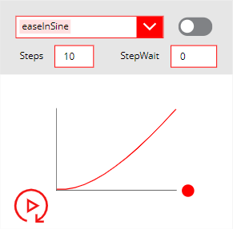
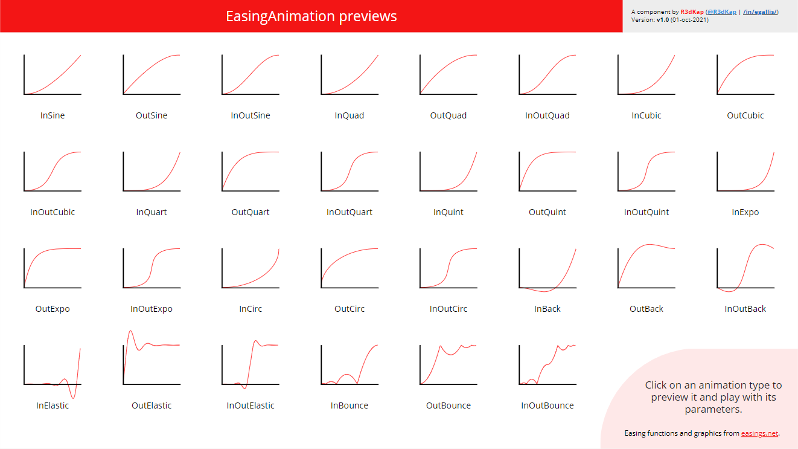
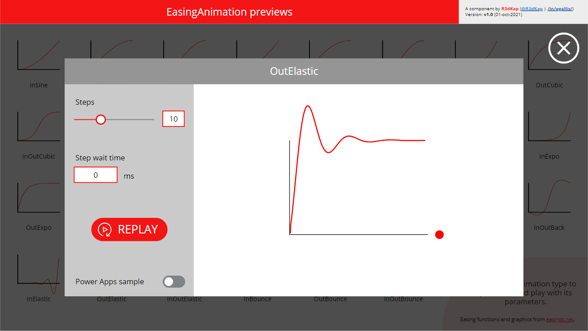
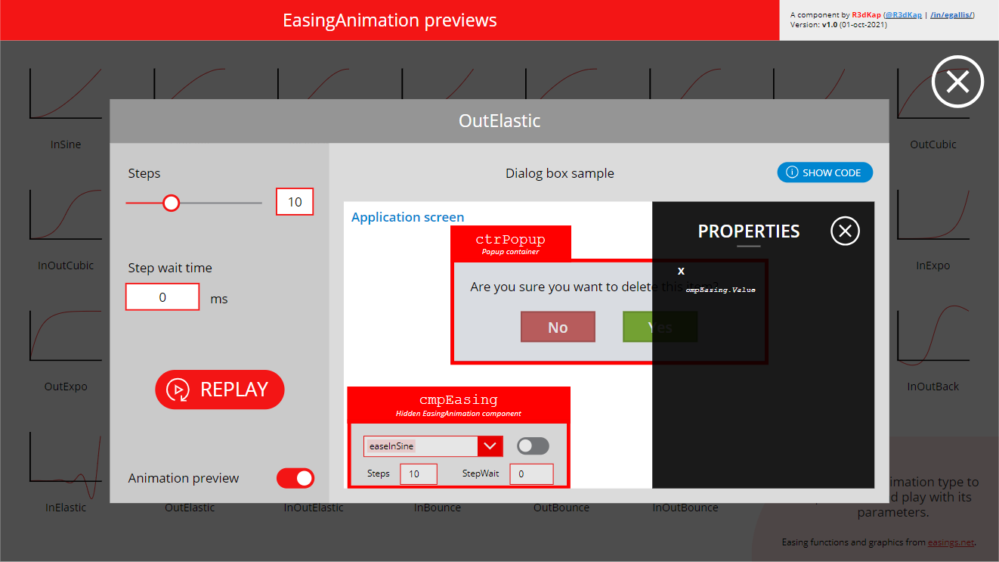

# EasingAnimation component
This component allows you to animate your Power Apps canvas controls to give life to your applications. Many animations are provided within the component. One instance of the component allows you to procdure **3 different animations simultaneously**.

This component is provided within a small application that allows you to preview and test the various animations that come with the **EasingAnimation** component:

Clicking on animation will let you play around with that animation:

After enabling the __Animation preview__ toggle, clicking the __SHOW CODE__ button will show you how to setup the properties of the control you want to animate as well as the hidden **EasingAnimation** component:

## **EasingAnimation** component properties
Here are the properties available to configure the **EasingAnimation** component:
### Input
- **Animation1** (record) = first animation settings
  - **AnimationType** (text) = name of the animation you want to use (use the **AnimationTypeEnum** output property)
  - **Start** (number) = starting pixel position of the control you want to animate
  - **End** (number) = ending pixel position of the control you want to animate
  - **Steps** (number) = number of steps to go from **Start** to **End**
  - **StepWait** (number) = number of milliseconds between each step
- **StartAnimation1** (boolean) = change its value to trigger the animation
- **ResetAnimation1** (boolean) = change its value to reset the animation
- **Animation2** (record) = second animation settings
  - **AnimationType** (text) = name of the animation you want to use (use the **AnimationTypeEnum** output property)
  - **Start** (number) = starting pixel position of the control you want to animate
  - **End** (number) = ending pixel position of the control you want to animate
  - **Steps** (number) = number of steps to go from **Start** to **End**
  - **StepWait** (number) = number of milliseconds between each step
- **StartAnimation2** (boolean) = change its value to trigger the second animation
- **ResetAnimation2** (boolean) = change its value to reset the second animation
- **Animation3** (record) = third animation settings
  - **AnimationType** (text) = name of the animation you want to use (use the **AnimationTypeEnum** output property)
  - **Start** (number) = starting pixel position of the control you want to animate
  - **End** (number) = ending pixel position of the control you want to animate
  - **Steps** (number) = number of steps to go from **Start** to **End**
  - **StepWait** (number) = number of milliseconds between each step
- **StartAnimation3** (boolean) = change its value to trigger the third animation
- **ResetAnimation3** (boolean) = change its value to reset the third animation
### Output
- **AnimationTypeEnum** (record) = list of all animation names that are provided by the component (use it to set the **AnimationType** property for each animation)
- **Value1** (number) = output value for the first animation
- **Value2** (number) = output value for the second animation
- **Value3** (number) = output value for the third animation
- **CalcHeight** = FOR INTERNAL USE ONLY
### Events
- **OnAnimation1End** = triggered when the first animation ends
- **OnAnimation2End** = triggered when the second animation ends
- **OnAnimation3End** = triggered when the third animation ends

__Note:__ always reset an animation before starting it!!!
__Note2:__ within a visible instance of the component on a screen you can preview each animation selecting it through the combo box and clicking the replay icon 😉

## How to install it?
- Download the app [here](EasingAnimation.zip)
- Go to https://make.powerapps.com
- Click on **Applications** in the left menu
- Click the **Import canvas app** button
- Select the downloaded app using the **Upload** button
- Click the **Import** button
- Wait for the import to finish
- You're all done!

Play or edit the app to see how to use and setup the component within your app.

Enjoy! 😊