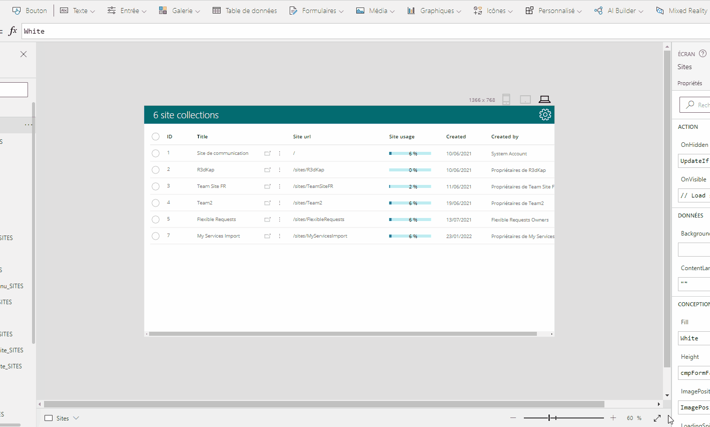

# FormFactorSelector component
This component allows you to change the form factor of your app's screen while you're within the Power Apps Studio. The sizes for the various form factors can be set through a single property of the component.

## How do I use it ?
Here are the instructions on how to best use this component inside the Power Apps Studio:
- **Import** the component into your app
- **Add** the component to the screen of your app that you want to test with different form factors
- **Set** its **X** coordinate to _Parent.Width - Self.Width_
- **Set** its **Y** coordinate to _-Self.Height_ (don't forget the '-' sign here)
- **Set** your screen's **Width** property to: _myFormFactorSelector.ScreenWidth_ (_myFormFactorSelector_ being the component's name you previously added to your screen)
- **Set** your screen's **Height** property to: _myFormFactorSelector.ScreenHeight_

You're good to go. Simply click on a form factor icon to change your screen's size (you don't need to press the ALT key to make it work 😉).
Click on the already active icon to rotate the screen 90° and simulate the landscape orientation for your screen.

## Properties
Here are the properties available to configure the component:
### Input
- **Default** (text) = default form factor (use the component's output enumeration **FormFactorEnum** to set the value)
- **Sizes** (record) = screen sizes for each form factor
### Output
- **FormFactorEnum** (record) = enumeration of available form factors
- **ScreenWidth** (number) = screen width value for the selected form factor
- **ScreenHeight** (number) = screen height for the selected form factor
- **Selected** (text) = selected form factor (taken from the **FormFactorEnum** enumeration)

## How does it look ?
Here is a capture of how the component looks like and how it works:

## HISTORY changes
**v1.0** [ 28-mar-2022 ]
- Initial version