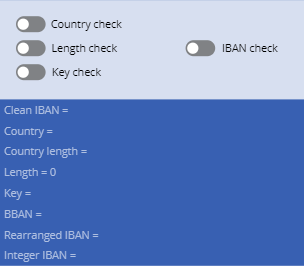
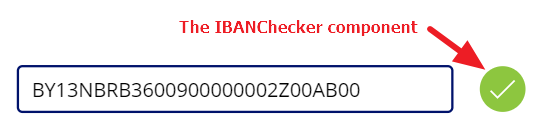

# IbanChecker component
This component will allow you to check if an IBAN (International Banking Account Number) number is correct (the algorithm can be found here: https://en.wikipedia.org/wiki/International_Bank_Account_Number).

Once it has been added to your app, the component will just show you a set of toggles that indicate which checks passed (*true*) and which failed (*false*). The **IBAN check** toggle is the one indicating if the whole IBAN number is correct:

Using the compact mode (see **CompactMode** input property below), you can ask the component to just display an icon showing the result of the check:

Supported countries are (along with their IBAN country code):
- Albania, AL
- Algeria, DZ
- Andorra, AD
- Angola, AO
- Austria, AT
- Azerbaijan, AZ
- Bahrain, BH
- Belarus, BY
- Belgium, BE
- Benin, BJ
- Bosnia and Herzegovina, BA
- Brazil, BR
- Bulgaria, BG
- Burkina Faso, BF
- Burundi, BI
- Cameroon, CM
- Cape Verde, CV
- Chad, TD
- Comoros, KM
- Congo, CG
- Costa Rica, CR
- Croatia, HR
- Cyprus, CY
- Czech Republic, CZ
- Denmark, DK
- Dominican Republic, DO
- East Timor, TL
- El Salvador, SV
- Egypt, EG
- Estonia, EE
- Faroe Islands, FO
- Finland, FI
- France, FR
- Gabon, GA
- Georgia, GE
- Germany, DE
- Gibraltar, GI
- Greece, GR
- Greenland, GL
- Guatemala, GT
- Honduras, HN
- Hungary, HU
- Iceland, IS
- Iran, IR
- Iraq, IQ
- Ireland, IE
- Israel, IL
- Italy, IT
- Ivory Coast, CI
- Jordan, JO
- Kazakhstan, KZ
- Kosovo, XK
- Kuwait, KW
- Latvia, LV
- Lebanon, LB
- Liechtenstein, LI
- Lithuania, LT
- Luxembourg, LU
- Madagascar, MG
- Mali, ML
- Malta, MT
- Mauritania, MR
- Mauritius, MU
- Moldova, MD
- Monaco, MC
- Montenegro, ME
- Morocco, MA
- Mozambique, MZ
- Netherlands, NL
- Nicaragua, NI
- Niger, NE
- North Macedonia, MK
- Norway, NO
- Pakistan, PK
- Palestinian territories, PS
- Poland, PL
- Portugal, PT
- Qatar, QA
- Romania, RO
- Saint Lucia, LC
- San Marino, SM
- Sao Tome and Principe, ST
- Saudi Arabia, SA
- Senegal, SN
- Serbia, RS
- Seychelles, SC
- Slovakia, SK
- Slovenia, SI
- Spain, ES
- Sweden, SE
- Switzerland, CH
- Togo, TG
- Tunisia, TN
- Turkey, TR
- Ukraine, UA
- United Arab Emirates, AE
- United Kingdom, GB
- Vatican City, VA
- Virgin Islands, British, VG

## Component properties
Here are the properties available to configure and use the component:
### Input
- **IBAN** (text) = the IBAN number
- **CompactMode** (boolean) = only shows a red cross icon or a green check icon depending on the IBAN verification result
- **ErrorMessages** (record) = list of messages to show as a tooltip when hovering the icon in **CompactMode**
### Output
- **IBANCheck** (boolean) = *true* if the IBAN number is correct
- **CountryCheck** (boolean) = *true* if the IBAN number's country is supported by the component
- **KeyCheck** (boolean) = *true* if the IBAN number key is correct (key value must be between 2 and 98)
- **LengthCheck** (boolean) = *true* if the IBAN number lenght is correct (varies according to the country)

The following other output parameters are for INTERNAL USE only:

- **CleanIBAN** (text) = IBAN number without spaces and dashes
- **CountryValue** (text) = IBAN number country code value
- **KeyValue** (text) = key portion of the IBAN number
- **BBANValue** (text) = the basic part of the IBAN number
- **RearrangedIBAN** (text) = rearranged IBAN number for calculating the IBAN number check value
- **IntergerIBAN** (text) = IBAN number converted to an integer value for calculation of the check value
- **IBANLenghts** (table) = IBAN number length for each supported country

## Important notes
- Make sure that the IBAN number that is being checked is compatible with the list of countries supported by the component (see above).

## How to use it
- Add the component to your app's screen where there is an text input field to enter an IBAN number
- Set the component's **IBAN** input parameter to the text input field's **Text** property
- If the **IBANCheck** output parameter of the component is *true*, the IBAN number is correct
- When an IBAN number is incorect (**IBANCheck**=*false*), you can use the **CountryCheck**, **KeyCheck** and **LengthCheck** output parameters to determine what is wrong (if it's *false*, that's where the problem lies)
- Hide the component if you just want to use the **IBANCheck** output property to verify the validity of an IBAN number

## HISTORY changes
**v0.1** [ 14-sept-2020 ]
- Initial publish

**v0.2** [ 18-sept-2020 ]
- Fixed an issue where very large IBAN numbers wouldn't check out correctly
- Added 2 new countries: SV & ST
- Added a compact mode view
- Rebranded the component
