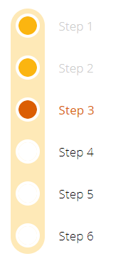

# MetroVerticalProgressBar component
This component is a configurable metro-like progress bar. Each step is like a metro station... :P

## Component properties
Here are the properties available to configure the progress bar:
### Input
- **Items** (table) = list of steps (each step has an id, a label and a visibility boolean)
- **Colors** (record) = the colors for the bar background, circles, labels, in each state (ToDo, Active, Done) and for the step circles border
- **BarWidth** (number) = in pixels, the width for the background bar
- **BarInnerMargin** (number) = in pixels, the inner margin between the bar and the steps circles
- **BarAutoHeight** (boolean) = if True, adjusts the height of the background bar to the visible steps, otherwise it has the same height as the component's
- **CirclePadding** (number) = in pixels, the padding between the steps circles
- **CircleBorderThickness** (number) = in pixels, the border thickness for the step circles
- **Size** (number) = font size for the steps labels
- **LabelPaddingLeft** (number) = in pixels, the left padding for the steps labels
- **ActiveStep** (number) = id of the current active step (must fit one of the ids in the **Items** property, otherwise no step is active)
- **AllowStepSelection** (boolean) = if True, triggers the **OnSelect** event toggle (see below) when a step is clicked
### Output
- **OnSelect** (boolean) = switches from False to True every time a step is clicked (if the **AllowStepSelection** is True): connect it to a hidden toggle control in your application to handle the click of a step
- **SelectedStep** (number) = id of the step that was clicked
- **ReservedHeight** (number) = in pixels, the calculated height needed by the component to display all the steps correctly (by design inside the component, it feeds the component's height; if you change the height of the component manually you will loose the automatic sizing of the component; to make it automatic again, feed the **Height** property of the component with its own **ReservedHeight** property)

## Example
Here is how your progress bar can look:\

## Notes
### Why ActiveStep and SelectedStep?
Separating the current active step from the selected step when a user clicks on a step allows you to put some code in-between. Meaning, when a user clicks on a step, you can do some checks *before* you actually set that step as active.\
To do so, just add a hidden toggle on your screen, set its **Default** property to the **OnSelect** output property from the component and in the **OnCheck** event of the toggle put your code to do the checks you want. Then at the end of your code, set a variable to change the **ActiveStep** of the progress bar to the **SelectedStep** value.

## History
- **20-feb-2020**: first release
