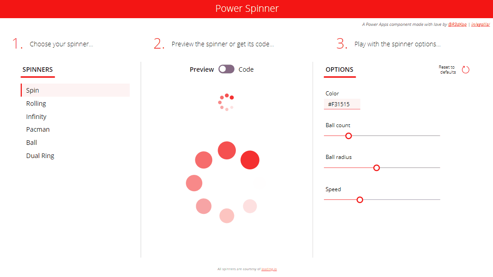

# PowerSpinner component
This component will to add a spinner to your Power Apps applications.

Additionnaly you will also find an MSAPP Power Apps application file that will allow you to play around with the various spinners offered by the component:

## Component properties
Here are the properties available to configure the component:
### Input
- **Spinner** (record) = the actual spinner displayed by the component (use the **SpinnerType** record output property to set its value)
- **SpinnerSettings** (record) = settings for all available spinners
### Output
- **SpinnerType** (record) = enumeration of available spinners (use it to set the current spinner in the **Spinner** input property)
- **SpinnerCode** (text) = code for the currently selected spinner to be placed in the **Image** property of an image control to place the spinner inside your app with a single image control

## How to use it
With this component, you can add a spinner to your Power Apps application using two different techniques:
1. Import the component into your app, set the **Spinner** and **SpinnerSettigs** properties as you wish and place you spinner wherever you want on your screen
2. Launch the PowerSpinner App and then:
    - Select the desired spinner
    - Play with it settings until it suits your needs
    - Toggle the _Preview/Code_ toggle to **Code**
    - Copy the code from the text input control
    - Add an image control to your app
    - Paste the code in the image control's **Image** property
    - ...et voilàaaa!

## Updates
- **12-16-2022**: initial release

