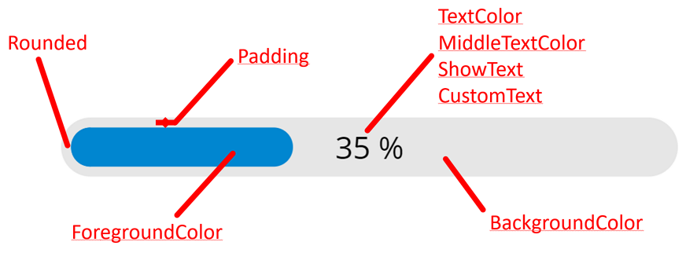

# ProgressBar component
This component alows you to add a linear horizontal progress bar to your Power Apps canvas applications.
Many properties allow you to customize the progress bar to your needs:

## Properties
Here are the properties available to configure the progress bar:
### Input
- **MaxValue** (number) = maximum value of the progress bar
- **Value** (number) = current value of the progress bar
- **Percentage** (boolean) = if True, shows a percentage value in the middle of the progress bar, else shows XXX / YYY (XXX being the current value and YYY the max value)
- **CustomText** (text) = a text replacing the percentage or the XXX / YYY label shown in the center of the progress bar
- **Rounded** (boolean) = if True, renders a progress bar with rounded edges, otherwise the progress bar is rectangular
- **Padding** (number) = number of pixels between the background and the progress bar itself
- **BackgroundColor** (color) = color for the background of the progress bar
- **ForegroundColor** (color) = color for the progress bar itself
- **TextColor** (color) = color for the label at the center of the progress bar showing the percentage, the XXX / YYY or the custom text
- **MiddleTextColor** (color) = color of that label once the value of the progress bar has reached half of its max value
- **Size** (number) = font size for the label shown at the center of the progress bar
- **ShowText** (boolean) = shows or hide the label shown at the center of the progress bar

## Examples
Using all these properties can allow you to add progress bars with various looks to your applications...

## HISTORY changes
**v1.0** [ 26-aug-2021 ]
- Initial publish