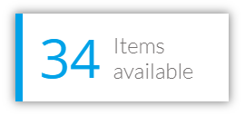
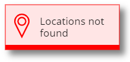

# ShadowBox component
This component shows a rectangle with a configurable drop shadow and colouring edge.

## Notes
### Align the shadow with your controls (v1.1)
Use the **MarginLeft**, **MarginRight**, **MarginTop** and **MarginBottom** output parameters to fit your shadow easily to your desired control.
For instance, let's say you have a control called *cmpColorPicker* to which you'd like to apply a shadow:
- Add the component to your screen, name it *cmpMyShadowBox* and set its position and size as follow:
```
    o cmpMyShadowBox.X = cmpColorPicker.X - cmpMyShadowBox.MarginLeft
    o cmpMyShadowBox.Y = cmpColorPicker.Y - cmpMyShadowBox.MarginTop
    o cmpMyShadowBox.Width = cmpColorPicker.Width + cmpMyShadowBox.MarginLeft + cmpMyShadowBox.MarginRight
    o cmpMyShadowBox.Height = cmpColorPicker.Height + cmpMyShadowBox.MarginTop + cmpMyShadowBox.MarginBottom
```
### Setting the edge position (v2.0)
Let's say you've added the component in your app and that you've named it *cmpMyShadowBox*. To set its edge position, simply set its **Position** option inside its **Edge** input parameter like this:
```
    cmpMyShadowBox.Edge.Position = cmpMyShadowBox.EdgePositionEnum.Left
```
### Making a full circle shadow (v2.0)
Setting the **Radius** option from the **Box** input property to a large value (actually greater than half the height of the box) will allow you to produce a full-circle shadow (assuming your box is square). For instance, it can be done this way:
```
    o cmpMyShadowBox.Width = Self.Height
    o cmpMyShadowBox.Box.Radius = Self.Height
```
**IMPORTANT**: when rouding the corners of the box, the edge cannot be displayed. The edge can be visible only if *Box.Radius = 0*.

## Properties
Here are the properties available to configure the box:
### Input
- **Shadow** (record) = set of parameters defining the shadow's look
    - *OffsetX* (number) = horizontal position of the shadow (positive: to the right; negative: to the left)
    - *OffsetY* (number) = vertical position of the shadow (positive: to the bottom; negative: to the top)
    - *Color* (text) = color for the shadow (color can be: color name, #rrggbb or rgb(rr,gg,bb))
    - *Blur* (number) = integer value to specify how much the shadow should be blurred
    - *Opacity* (number) = value between 0 and 1 to specify the shadow opacity (0 is transparent, 1 is opaque)
- **Box** (record) = set of parameters defining the box's look
    - *Fill* (text) = fill color for the inner box (color can be: color name, #rrggbb or rgb(rr,gg,bb))
    - *Opacity* (number) = value between 0 and 1 to specify the inner box fill color opacity (0 is transparent, 1 is opaque)
    - *BorderThickness* (number) = width value for the inner box border (in pixels)
    - *BorderColor* (text) = color for the inner box border (color can be: color name, #rrggbb or rgb(rr,gg,bb))
    - *Radius* (number) = radius (in pixels) to round the box's corners
- **Edge** (record) = set of parameters defining the edge's look
    - *Position* (text) = position of the colouring edge (to be defined using the **EdgePositionEnum** output parameter of the component)
    - *Width* (number) = width of the colouring edge (in pixels)
    - *Color* (text) = color for the colouring edge (color can be: color name, #rrggbb or rgb(rr,gg,bb))
    - *Padding* (number) = padding between the inner box border and the colouring edge (in pixels)
- **ShowEdge** (boolean) = displays a colouring edge inside the box
### Output
- **MarginLeft** (number) = distance between the left border of the component and the left border of the inner box
- **MarginRight** (number) = distance between the right border of the component and the right border of the inner box
- **MarginTop** (number) = distance between the top border of the component and the top border of the inner box
- **MarginBottom** (number) = distance between the bottom border of the component and the bottom border of the inner box
- **EdgePositionEnum** (record) = enumeration of the various edge positions allowed: left, top, right, bottom

## Examples
Drop shadow placed behind a text input box:


Nice visual cards where some text and icon controls have been placed in front of the shadow box:





Shadows for buttons:


Playing with the **Radius** option of the **Box** parameter, you can easily produce a perfect circle shadow:


## HISTORY changes
**v1.0** [ 10-oct-2019 ]
- Initial publish

**v1.1**  [ 01-dec-2019 ]
- Added margins output parameters

**v2.0**  [ 20-sep-2021 ]
- Regrouping of input parameters
- Added rounded corner radius
- Added enumeration for edge positionning