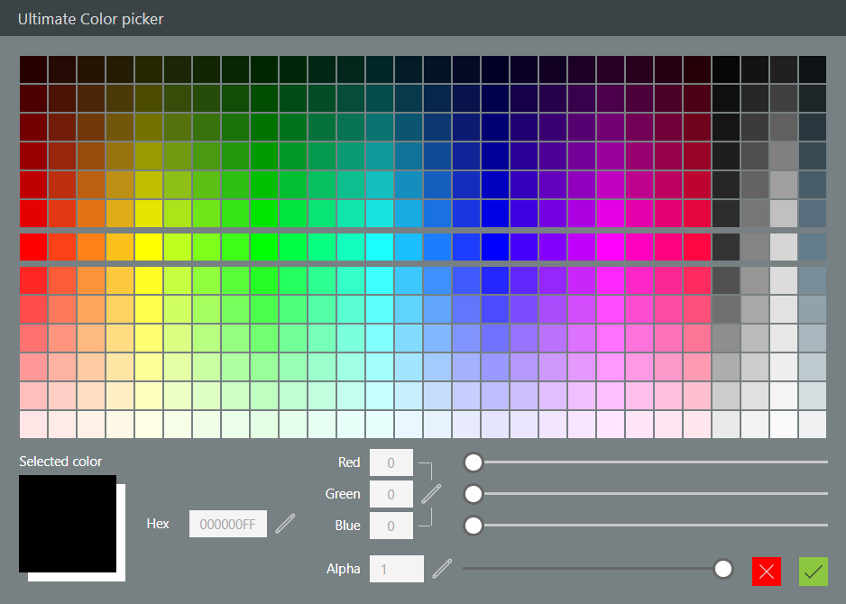

# UltimateColorPicker component
This color picker component will automatically calculate a palette of light and dark shades based on a list of main colors you will provide.

## How to use it
Please follow these instructions:
- Insert the component on a screen in your app
- Set the list of main colors in the **MainColors** input parameter of the component (check out the default sample values)
- If needed, set the default selected color value using the **DefaultColor** input parameter (use format *#rrggbbaa*)
- Customize the size of the squares and their padding using the **ColorSquareSize** and **ColorSquaresPadding** input parameters
- DO NOT RESIZE the component manually; it's automatic
- Once the user has chosen his color, check out the **SelectedButton** output parameter to see if he pressed *OK* or *CANCEL*
- Chosen color is in one of the output color parameters (see below)

## Features
Here is the list of features provided with this color picker:
- Customizable title
- Set title's visibility
- Set author's link visibility
- Set component's version number label visibility
- Customizable main colors (center row in the palette)
- Automatic light and dark shades palette based on main colors
- Greyscales dedicated shades palette
- Customizable color square size and padding between squares
- Customizable selected color background (usefull when alpha < 1)
- Active color in color picker palette is pin-pointed by a bullet point
- Selected color can be set in Hex mode or in RGB mode
- RGB color and alpha values can be set using sliders or with the keyboard
- Output of selected color in multiple formats: Power Apps color, Hex, RGBA separated values, "RGBA(r,g,b,a)" string
- *COMING SOON* - Customizable number of shades for the palette
- *COMING SOON* - Responsive component

## Properties
Here are the properties available to configure the color picker:
### Input
- **DefaultColor** (color) = default selected color (in the form #rrggbb)
- **Title** (string) = title for the component
- **TitleColor** (color) = text color for the component's title and version number
- **HideAuthor** (boolean) = hides the author displayed in the component's title bar
- **HideVersion** (boolean) = hides the version number displayed in the component's title bar
- **ShowTitle** (boolean) = shows or hides the component's title
- **MainColors** (table) = main colors list in the form: *Table({Value: "#rrggbb"},{Value: "#rrggbb"},...)*
- **ShadesCount** (number) = number of shades in the palette (*COMING SOON*)
- **ColorSquareSize** (number) = size, in pixels, for the palette color squares
- **ColorSquaresPadding** (number) = padding between the palette color squares
- **SelectedColorBg** (color) = color for the background behind the selected color square
### Output
- **SelectedColor** (color) = picked color value in Power Apps color format
- **Red** (number) = red value for the picked color
- **Green** (number) = green value for the picked color
- **Blue** (number) = blue value for the picked color
- **SelectedAlpha** (number) = alpha value for the picked color
- **SelectedRGB** (string) = picked color in RGBA string format: *RGBA(&lt;r&gt;,&lt;g&gt;,&lt;b&gt;,&lt;a&gt;,)*
- **SelectedHex** (string) = picked color in Hex format: *#rrggbbaa*
- **SelectedButton** (string) = button clicked (value can be: *OK* or *CANCEL*)
- **ReservedWidth** (number) = *RESERVED FOR INTERNAL USE ONLY*
- **ReservedHeight** (number) = *RESERVED FOR INTERNAL USE ONLY*

## HISTORY changes
**v1.0** [ 29-nov-2019 ]
- Initial publish

**v1.1**  [ 01-dec-2019 ]
- Added greyscale palette
- Fixed component auto-size
- Fixed positionning of some controls
- Grouped controls inside containers
- Prefixed hex output with "#"
- Added *TitleColor* input parameter to set component's title bar text color
- Added author link + *HideAuthor* input parameter to hide author
- Added version label + *HideVersion* input parameter to hide version number
