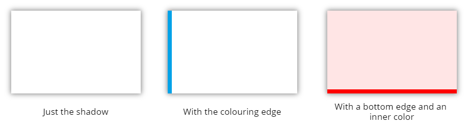

# Components
## Toggle Set
This component lets you create and customize a set of items that can be toggled:

[Click here for details](Components/ToggleSet/readme.md).

Link to download the component MSAPP file: [Download here](Components/ToggleSet/ToggleSet.msapp).

## Metro Vertical Progress Bar
This component is a fully customizable progress bar with a metro/stations like look:

[Click here for details](Components/MetroVerticalProgressBar/readme.md).

Link to download the component MSAPP file: [Download here](Components/MetroVerticalProgressBar/MetroVerticalProgressBar.msapp).

## Shadow Circle
This component allows you to create a circle with its configurable drop shadow, inner solid or gradient color fill:

[Click here for details](Components/ShadowCircle/readme.md).

Link to download the component MSAPP file: [Download here](Components/ShadowCircle/ShadowCircle.msapp).

## Ultimate Color Picker
This highly customizable color picker will show a wide range of palette colors based on main colors (middle row) you provide.

[Click here for details](Components/UltimateColorPicker/readme.md).

Link to download the component MSAPP file: [Download here](Components/UltimateColorPicker/UltimateColorPicker.msapp).

## Office UI Fabric Icon Generator
This component allows one to generate the SVG code for an icon picked among the whole list of the Office UI Fabric Icons (which can be [found here](https://uifabricicons.azurewebsites.net/)). This SVG code can then be used in an *Image* control in any Power Apps application.

[Click here for details](Components/OfficeUIFabricIconGenerator/readme.md).

Link to download the component MSAPP file: [Download here](Components/OfficeUIFabricIconGenerator/OfficeUIFabricIconGenerator.msapp).

## Shadow Box
This component shows a rectangle with a configurable drop shadow and colouring:

[Click here for details](Components/ShadowBox/readme.md) and other nice examples.

Link to download the component MSAPP file: [Download here](Components/ShadowBox/ShadowBox.msapp).

## Circle Progress Bar
This component is a configurable circle progress bar:

[Click here for details](Components/CircleProgressBar/CircleProgressBar.md)

Link to download the component MSAPP file: [Download here](Components/CircleProgressBar/CircleProgressBar.msapp).